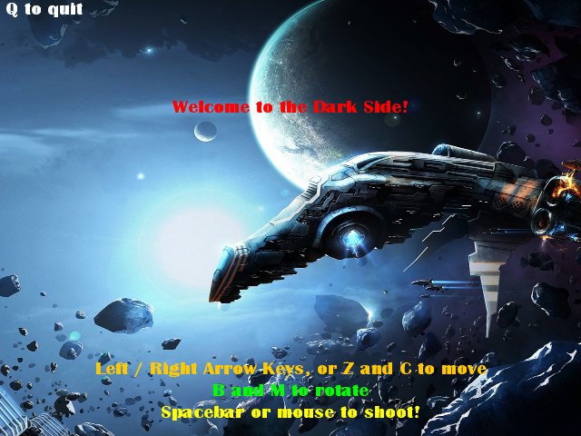
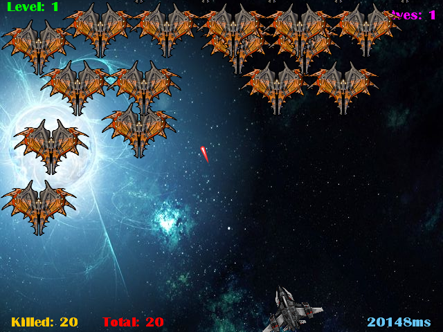
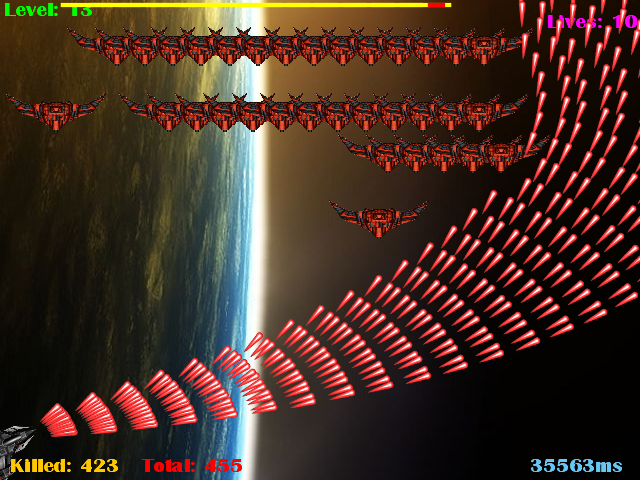
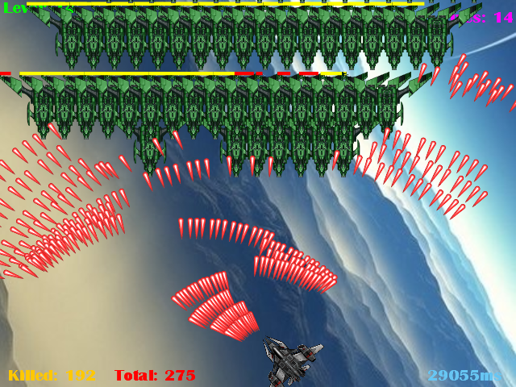

# SpaceInvaders
This is a take on space invaders of old. This time, modern PCs should be able to handle a few extra lasers and bullets. 

Download here: 

It was for computer science E214 in the first semester of 2014.

The more lasers.. well.. the merrier.

I wonder if your pc can handle it?

I've also added some 8-bit music, and a piano piece of my own.
